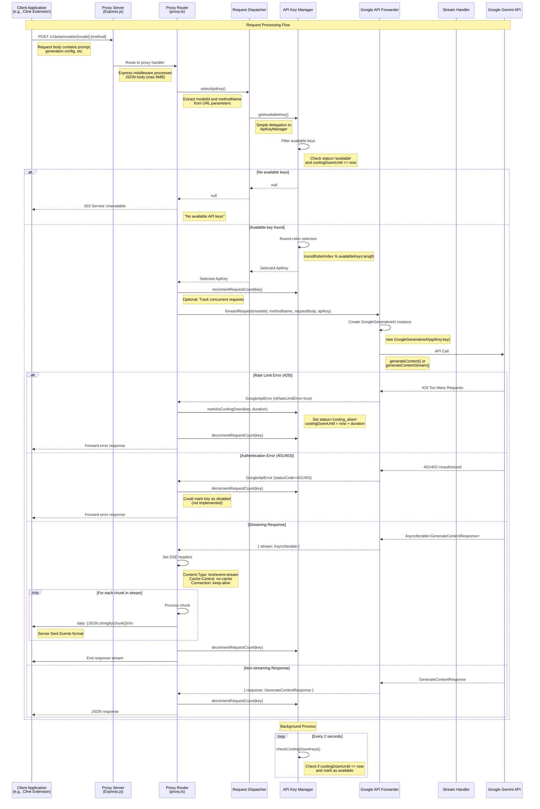

# Development Guide for API Key Aggregator VS Code Extension

This document provides instructions for setting up the development environment, building, running, and contributing to the API Key Aggregator VS Code Extension project.

## Prerequisites

*   Node.js (version 20.x or later recommended)
*   npm (usually comes with Node.js)
*   Git
*   VS Code

## Setting up the Development Environment

1.  **Clone the project:**
    ```bash
    git clone https://github.com/JamzYang/api-key-aggregetor
    cd api-key-aggregetor
    ```
2.  **Install dependencies:**
    ```bash
    npm install -g yo generator-code
    npm install
    ```
3.  **Open the extension project in VS Code:**
    ```bash
    code api-key-aggregetor
    ```

## Building and Running

1.  **Compile the project:**
    ```bash
    npm run compile
    ```
    Or use `npm run watch` to automatically recompile on file changes.

2.  **Run the extension (Debug Mode):**
    *   In the newly opened VS Code window, open the Debug View (usually the bug icon in the sidebar).
    *   Select the "Run Extension" configuration from the top dropdown menu.
    *   Click the green start debugging button.

    This will open a new VS Code window with the extension we are developing loaded. When the extension is activated, the embedded proxy server should start and output startup information in the debug console (e.g., "Proxy server is running on port XXXX").

## Testing

*   Run tests using the command:
    ```bash
    npm test
    ```

## Packaging the Extension

*   To package the extension for distribution, execute:
    ```bash
    vsce package
    ```
    This will create a `.vsix` file in the project root directory.

## Request Flow Architecture

The following sequence diagram illustrates how a request flows through the API Key Aggregator system, from the initial client request to the final response from the Gemini API.



### Key Components Explanation

1. **API Key Management**: The `ApiKeyManager` maintains a pool of API keys with different states:
   - `available`: Ready to use
   - `cooling_down`: Temporarily disabled due to rate limiting
   - `disabled`: Permanently disabled (not currently implemented)

2. **Request Distribution**: Uses a simple round-robin strategy to distribute requests among available API keys.

3. **Error Handling**:
   - Rate limit errors (429) trigger a cooling-down period for the affected API key
   - Authentication errors (401/403) are forwarded to the client
   - Other errors are passed through the error handling middleware

4. **Streaming Support**: The system supports both regular and streaming responses from the Gemini API, with proper Server-Sent Events formatting for streaming responses.

5. **Concurrency Control**: Optional request counting mechanism to track concurrent requests per API key.

## Project Status and Future Plans

*   Consider more complex request distribution strategies.