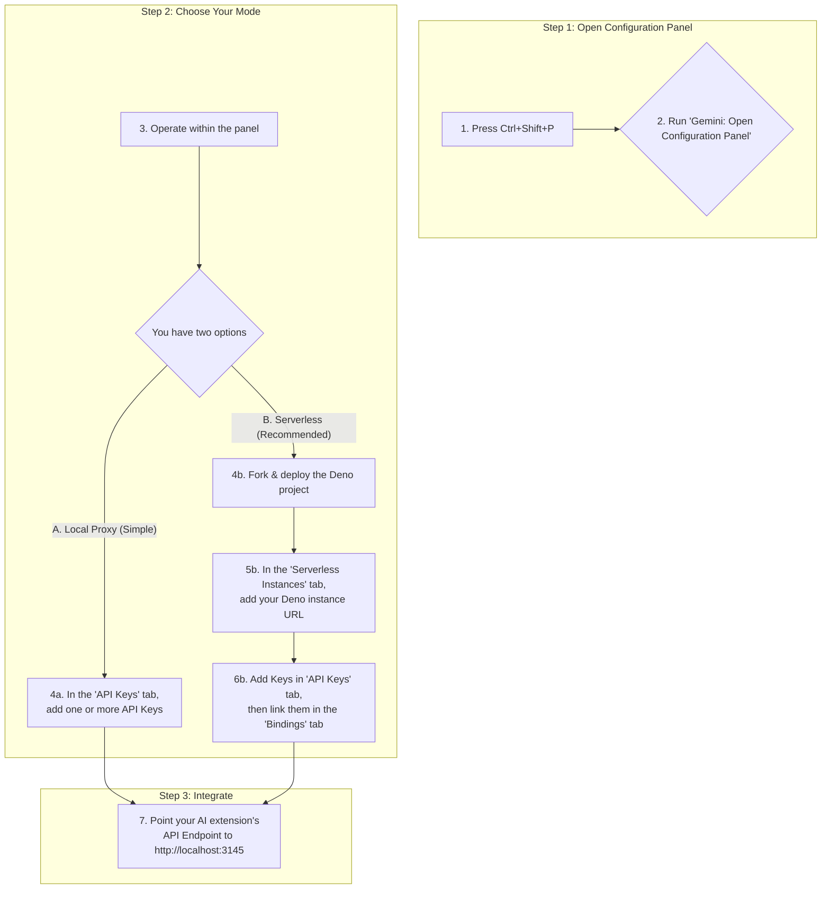

# API Key Aggregator VS Code Extension

Are you a developer using intelligent coding plugins like **Cline** or **Roo Code** and frequently encountering `429 too many requests` errors with the free tier of the Gemini API? This often happens due to concurrency limits when making multiple requests.

This tool provides a solution by aggregating multiple Gemini API keys and distributing requests among them. It offers two core modes: a simple **local proxy** for quick setup and a powerful **Serverless distribution** via Deno Deploy to truly bypass IP-based rate limits. By using this extension, you can achieve **double freedom** in both **token usage** and **query frequency**.

## Features

*   ✅ **Unified Configuration Panel**: Easily manage all settings through a user-friendly UI, no need to memorize complex commands.
*   ✅ **Multiple Deployment Modes**: Supports `local`, `serverless`, and `hybrid` (Serverless with local fallback) modes to fit your needs.
*   ✅ **True Multi-IP Distribution**: Integrates with Deno Deploy to distribute requests from different IP addresses, effectively eliminating IP rate limits.
*   ✅ **Flexible Key-to-Instance Binding**: Assign specific API Keys to dedicated Serverless instances for optimized routing.
*   ✅ **Health Status Monitoring**: Automatically checks the connectivity and response time of your Serverless instances.
*   ✅ **Built-in Proxy Server**: Embeds an HTTP proxy server within the VS Code extension.
*   ✅ **Streaming Response Support**: Natively forwards streaming responses from the Google Gemini API.

## Quick Start

Getting started is easy. All configurations can be managed through the **Configuration Panel**.



### Mode A: Local Proxy (Quickest Setup)

This is the simplest way to get started if you want to pool multiple API keys from a single IP address.

1.  Press `Ctrl+Shift+P` (or `Cmd+Shift+P` on Mac) and run the command **`Gemini: Open Configuration Panel`**.
2.  Navigate to the **`API Keys`** tab.
3.  Click "Add New API Key" and enter your Gemini API Key.
4.  Repeat to add as many keys as you need.
5.  **You're done!** The proxy is now running.

### Mode B: Serverless Distribution (Recommended)

This mode unleashes the full power of the extension by routing requests through different IP addresses, avoiding IP-based rate limits.

**1. Prepare Your Deno Instance**

First, you need a free Deno Deploy instance to act as your personal proxy.

1.  **Fork the repository**: Go to [https://github.com/JamzYang/deno-gemini-proxy](https://github.com/JamzYang/deno-gemini-proxy) and click the "Fork" button.
2.  **Install `deployctl`**: Open your terminal and run the following command:
    ```bash
    deno install -gArf jsr:@deno/deployctl
    ```
3.  **Deploy the project**: Navigate to your forked project's directory in the terminal and run:
    ```bash
    deployctl deploy
    ```
    Follow the on-screen prompts. Once finished, you will get a Deno Deploy URL (e.g., `https://your-project-name.deno.dev`). Copy this URL.

**2. Configure in VS Code**

1.  Press `Ctrl+Shift+P` and run **`Gemini: Open Configuration Panel`**.
2.  Go to the **`Serverless Instances`** tab and add your Deno Deploy URL.
3.  Go to the **`API Keys`** tab and add your Gemini API Key(s).
4.  Go to the **`Bindings`** tab to link your API Key(s) to your Deno instance.
5.  (Optional but recommended) Go to the **`Settings`** tab and change the Deployment Mode to **`Hybrid`** or **`Serverless`**.

## Configuration Panel Overview

The **Configuration Panel** is your one-stop shop for managing this extension.

*   **Overview**: See a dashboard of your current setup.
*   **API Keys**: Add, delete, and modify your Gemini API Keys.
*   **Serverless Instances**: Manage your Deno Deploy instances.
*   **Bindings**: Link specific API Keys to specific instances.
*   **Settings**: Switch between `local`, `serverless`, and `hybrid` deployment modes.

## Integration with other extensions (e.g., Cline)

Once the proxy server is successfully started, it will listen on a specific port (default is 3145). Other extensions that need to use the Gemini API (like Cline) can configure their API Endpoint to point to the address and port of this local proxy server.

For example, in the Cline extension settings, configure the Gemini API Endpoint to `http://localhost:3145`.

## Configuration Reference

You can configure the extension through VS Code settings (`settings.json`):

```json
{
  "geminiAggregator.port": 3145,
  "geminiAggregator.deploymentMode": "hybrid",
  "geminiAggregator.serverlessInstances": [
    {
      "id": "deno-us-east",
      "name": "Deno US East",
      "url": "https://your-app-us.deno.dev",
      "region": "us-east-1"
    }
  ],
  "geminiAggregator.fallbackToLocal": true,
  "geminiAggregator.requestTimeout": 60000,
  "geminiAggregator.retryAttempts": 2
}
```

| Parameter | Type | Default | Description |
|-----------|------|---------|-------------|
| `port` | number | 3145 | Port for the proxy server. |
| `deploymentMode` | string | "local" | Deployment mode: `local`, `serverless`, or `hybrid`. |
| `serverlessInstances` | array | [] | List of Serverless instance configurations. |
| `fallbackToLocal` | boolean | true | Whether to fallback to local processing in `hybrid` mode. |
| `requestTimeout` | number | 30000 | Request timeout in milliseconds for Serverless requests. |
| `retryAttempts` | number | 2 | Number of retry attempts for failed Serverless requests. |

## Command Reference

While the Configuration Panel is recommended, you can still use commands:

| Command | Description |
|---------|-------------|
| `Gemini: Open Configuration Panel` | **(Recommended)** Open the main configuration UI. |
| `Gemini: Add API Key` | Add a new API key. |
| `Gemini: List API Keys` | View configured API keys. |
| `Gemini: Modify API Key` | Modify an existing API key. |
| `Gemini: Delete API Key` | Delete an API key. |
| `Gemini: Add Serverless Instance` | Add a Serverless instance. |
| `Gemini: Remove Serverless Instance` | Remove a Serverless instance. |
| `Gemini: List Serverless Instances` | View configured instances. |
| `Gemini: Set Deployment Mode` | Set deployment mode. |
| `Gemini: Bind API Key to Instance` | Bind API Key to instance. |
| `Gemini: Unbind API Key` | Unbind API Key. |
| `Gemini: Show Status` | Show system status. |

## 中文文档

[点击此处查看中文版 README](README.zh-CN.md)

---

## Support This Project

If you find this project helpful, please consider giving it a star on GitHub! Your support is greatly appreciated.

[](https://github.com/JamzYang/api-key-aggregetor)