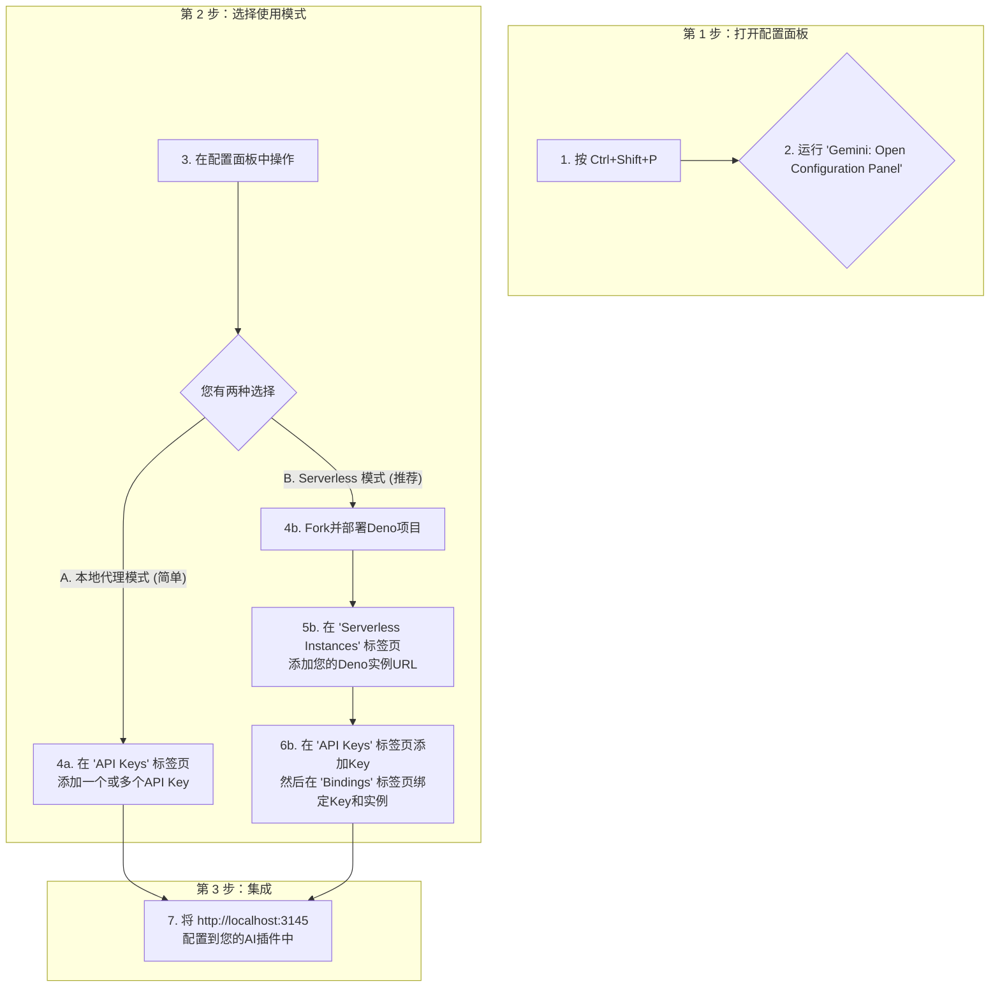

# API Key Aggregator VS Code 扩展

您是否是使用 **Cline**、**Roo Code** 等智能代码插件的开发者，并且在使用 Gemini API 免费版时频繁遇到 `429 too many requests` 的困扰？这通常是由于并发请求过多导致的限制。

本项目提供了一个解决方案，通过聚合多个 Gemini API Key 并将请求分发到不同的 Key 上。它提供两种核心模式：简单的**本地代理**用于快速配置，以及强大的**Serverless分发**（通过Deno Deploy）来真正绕过IP级别的速率限制。使用本扩展，您可以有效突破单个免费 API Key 的限制，实现 **token** 和**提问次数**的**双自由**。

## 功能亮点

*   ✅ **统一配置面板**：通过友好的用户界面轻松管理所有设置，无需记忆繁琐的命令。
*   ✅ **多种部署模式**：支持 `本地`、`Serverless` 和 `混合`（Serverless优先，本地备用）三种模式，以适应不同需求。
*   ✅ **真正的多IP分发**：通过集成Deno Deploy，实现从不同IP地址分发请求，有效规避IP速率限制。
*   ✅ **灵活的绑定策略**：可将特定的API Key分配给专用的Serverless实例，以实现优化路由。
*   ✅ **健康状态监控**：自动测试Serverless实例的连通性与响应时间。
*   ✅ **内嵌代理服务器**：在VS Code扩展中内嵌一个HTTP代理服务器。
*   ✅ **支持流式响应**：原生转发Google Gemini API的流式响应。

## 快速上手

上手非常简单。所有配置都可以通过**配置面板**完成。



### 模式A：本地代理（最快配置）

如果您希望在同一个IP地址下汇聚多个API Key，这是最简单的入门方式。

1.  按 `Ctrl+Shift+P` (Mac上为 `Cmd+Shift+P`) 并运行命令 **`Gemini: Open Configuration Panel`**。
2.  切换到 **`API Keys`** 标签页。
3.  点击“添加新的API Key”并输入您的Gemini API Key。
4.  重复此操作以添加您需要的所有Key。
5.  **完成！** 代理服务现在已开始运行。

### 模式B：Serverless分发（推荐）

此模式通过不同IP地址路由请求，释放了扩展的全部潜力，可避免IP级别的速率限制。

**1. 准备您的Deno实例**

首先，您需要一个免费的Deno Deploy实例作为您的个人代理。

1.  **Fork仓库**：访问 [https://github.com/JamzYang/deno-gemini-proxy](https://github.com/JamzYang/deno-gemini-proxy) 并点击 "Fork" 按钮。
2.  **安装 `deployctl`**：打开您的终端并运行以下命令：
    ```bash
    deno install -gArf jsr:@deno/deployctl
    ```
3.  **部署项目**：在终端中进入您Fork的项目目录，并运行：
    ```bash
    deployctl deploy
    ```
    根据屏幕提示操作。完成后，您将获得一个Deno Deploy URL（例如 `https://your-project-name.deno.dev`）。请复制此URL。

**2. 在VS Code中配置**

1.  按 `Ctrl+Shift+P` 并运行 **`Gemini: Open Configuration Panel`**。
2.  进入 **`Serverless Instances`** 标签页，添加您的Deno Deploy URL。
3.  进入 **`API Keys`** 标签页，添加您的Gemini API Key。
4.  进入 **`Bindings`** 标签页，将您的Key与Deno实例进行绑定。
5.  （可选但推荐）进入 **`Settings`** 标签页，将部署模式更改为 **`Hybrid`** 或 **`Serverless`**。

## 配置面板概览

**配置面板**是您管理此扩展的一站式中心。

*   **概览 (Overview)**：查看您当前设置的仪表盘。
*   **API Keys**: 添加、删除和修改您的Gemini API Key。
*   **Serverless实例 (Serverless Instances)**：管理您的Deno Deploy实例。
*   **绑定 (Bindings)**：将特定的API Key链接到特定的实例。
*   **设置 (Settings)**：在 `local`、`serverless` 和 `hybrid` 部署模式之间切换。

## 与其他扩展集成（例如 Cline）

一旦代理服务器成功启动，它将监听一个特定的端口（默认为 3145）。其他需要使用 Gemini API 的扩展（如 Cline）可以将它们的 API Endpoint 配置指向这个本地代理服务器的地址和端口。

例如，在 Cline 插件的设置中，将 Gemini API Endpoint 配置为 `http://localhost:3145`。

## 配置参数参考

您可以通过VS Code的 `settings.json` 文件来配置本扩展：

```json
{
  "geminiAggregator.port": 3145,
  "geminiAggregator.deploymentMode": "hybrid",
  "geminiAggregator.serverlessInstances": [
    {
      "id": "deno-us-east",
      "name": "Deno US East",
      "url": "https://your-app-us.deno.dev",
      "region": "us-east-1"
    }
  ],
  "geminiAggregator.fallbackToLocal": true,
  "geminiAggregator.requestTimeout": 180000
}
```

| 参数 | 类型 | 默认值 | 描述 |
|-----------|------|---------|-------------|
| `port` | `number` | 3145 | 代理服务器使用的端口。 |
| `deploymentMode` | `string` | "local" | 部署模式：`local`、`serverless` 或 `hybrid`。 |
| `serverlessInstances` | `array` | [] | Serverless实例配置列表。 |
| `fallbackToLocal` | `boolean` | true | 在 `hybrid` 模式下，当Serverless实例失败时是否回退到本地处理。 |
| `requestTimeout` | `number` | 180000 | Serverless请求的超时时间（毫秒）。 |

## 命令参考

虽然我们推荐使用配置面板，但您仍然可以使用命令：

| 命令 | 描述 |
|---------|-------------|
| `Gemini: Open Configuration Panel` | **(推荐)** 打开主配置界面。 |
| `Gemini: Add API Key` | 添加一个新的API Key。 |
| `Gemini: List API Keys` | 查看已配置的API Key。 |
| `Gemini: Modify API Key` | 修改一个已有的API Key。 |
| `Gemini: Delete API Key` | 删除一个API Key。 |
| `Gemini: Add Serverless Instance` | 添加一个Serverless实例。 |
| `Gemini: Remove Serverless Instance` | 移除一个Serverless实例。 |
| `Gemini: List Serverless Instances` | 查看已配置的实例。 |
| `Gemini: Set Deployment Mode` | 设置部署模式。 |
| `Gemini: Bind API Key to Instance` | 绑定API Key到实例。 |
| `Gemini: Unbind API Key` | 解绑API Key。 |
| `Gemini: Show Status` | 显示系统状态。 |

---

## 支持本项目

如果您觉得本项目对您有帮助，请考虑在 GitHub 上给它一个 Star！您的支持是对我最大的鼓励。

[](https://github.com/JamzYang/api-key-aggregetor)
