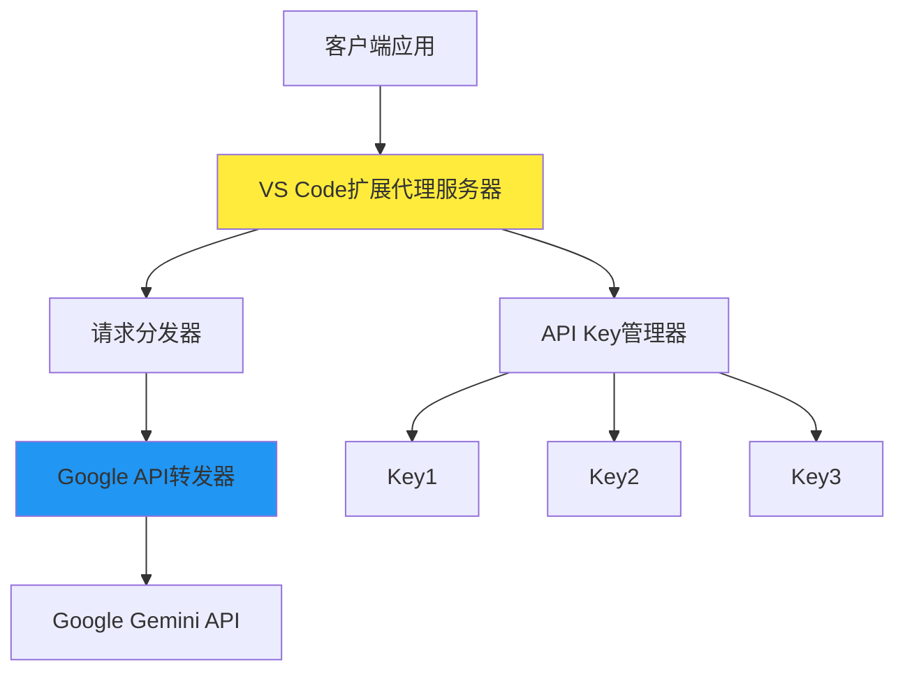
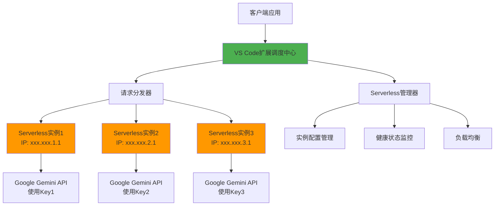
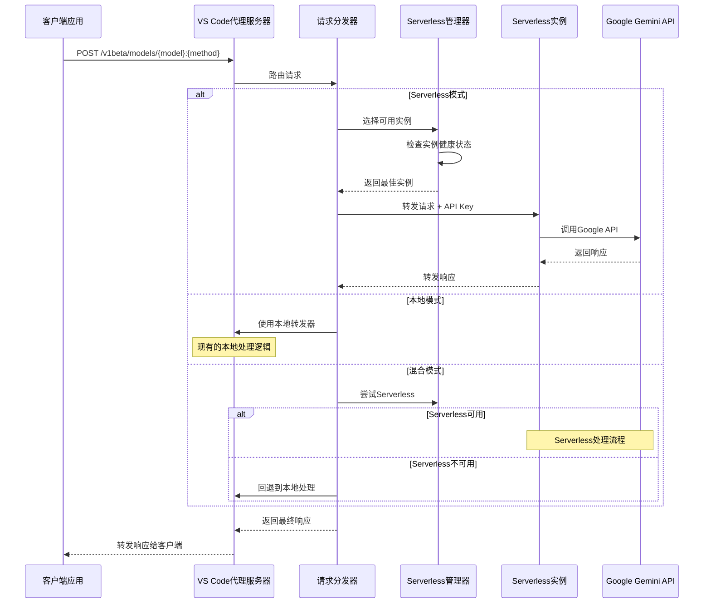

# Serverless多IP分发技术架构文档

## 概述

本文档详细描述了API Key Aggregator项目从单一本地代理架构向Serverless多IP分发架构的演进设计。新架构旨在通过多个Serverless实例实现真正的多IP请求分发，突破单一IP地址的限制。

## 技术原理

### 核心问题
当前架构虽然支持多个API Key轮询，但所有请求都来自同一个本地IP地址，这可能导致：
- Google API对单一IP的更严格限制
- 无法充分利用多个API Key的优势
- 潜在的IP级别封禁风险

### 解决方案
通过部署多个Serverless实例（如Deno Deploy），每个实例：
- 拥有独立的IP地址
- 负责特定API Key的请求转发
- 提供地理分布的请求来源

## 架构对比

### 当前本地架构



**特点：**
- 单一本地IP地址
- 本地轮询多个API Key
- 简单的错误处理和冷却机制

### 新Serverless架构



**特点：**
- 多个独立IP地址
- 分布式请求处理
- 智能调度和故障转移

## 请求路由流程

### 详细请求流程图



## 组件交互关系

### 核心组件设计

#### 1. Serverless管理器 (ServerlessManager)
```typescript
class ServerlessManager {
  private instances: Map<string, ServerlessInstance>
  private healthChecker: HealthChecker
  
  // 实例管理
  addInstance(instance: ServerlessInstance): void
  removeInstance(id: string): void
  getAvailableInstance(): ServerlessInstance | null
  
  // 健康监控
  checkInstanceHealth(id: string): Promise<boolean>
  markInstanceUnavailable(id: string): void
}
```

#### 2. Serverless转发器 (ServerlessForwarder)
```typescript
class ServerlessForwarder {
  async forwardRequest(
    instanceUrl: string,
    modelId: string,
    methodName: string, 
    requestBody: any,
    apiKey: string
  ): Promise<ForwardResult>
  
  // 支持流式响应
  async handleStreamResponse(stream: AsyncIterable): Promise<void>
}
```

#### 3. 增强的请求分发器 (Enhanced RequestDispatcher)
```typescript
class RequestDispatcher {
  // 现有功能保持
  async selectApiKey(): Promise<ApiKey | null>
  
  // 新增功能
  async selectServerlessInstance(): Promise<ServerlessInstance | null>
  async determineForwardingTarget(): Promise<'local' | ServerlessInstance>
}
```

### 数据模型

#### Serverless实例模型
```typescript
interface ServerlessInstance {
  id: string                    // 实例唯一标识
  name: string                  // 用户友好名称
  url: string                   // 实例端点URL
  region?: string               // 部署区域
  status: 'active' | 'inactive' | 'error'
  assignedApiKeys: string[]     // 分配的API Key列表
  lastHealthCheck?: number      // 最后健康检查时间
  responseTime?: number         // 平均响应时间
}
```

#### 部署配置模型
```typescript
interface DeploymentConfig {
  mode: 'local' | 'serverless' | 'hybrid'
  fallbackToLocal: boolean
  timeout: number
}
```

## 技术优势

### 1. IP多样化
- 每个Serverless实例提供独立IP
- 降低IP级别限制风险
- 提高整体可用性

### 2. 地理分布
- 可部署到不同地理区域
- 降低网络延迟
- 提供更好的用户体验

### 3. 弹性扩展
- 按需添加Serverless实例
- 自动故障转移
- 无需维护服务器基础设施

### 4. 成本效益
- 利用Serverless免费额度
- 按使用量付费
- 无固定基础设施成本

## 技术挑战与解决方案

### 1. 网络延迟
**挑战：** 增加了一层网络跳转
**解决方案：** 
- 选择地理位置较近的Serverless区域
- 实现智能路由选择最优实例
- 缓存机制减少重复请求

### 2. 配置复杂性
**挑战：** 需要管理多个Serverless实例
**解决方案：**
- 提供简化的配置界面
- 自动化部署脚本
- 智能默认配置

### 3. 调试困难
**挑战：** 分布式架构增加调试复杂度
**解决方案：**
- 完善的日志记录
- 请求追踪机制
- 统一的错误处理

### 4. 状态同步
**挑战：** 多个实例间的状态协调
**解决方案：**
- 无状态设计
- 本地状态管理
- 定期健康检查

## 向后兼容性

### 兼容性保证
1. **默认行为不变**：新安装默认使用本地模式
2. **配置隔离**：新配置不影响现有API Key管理
3. **渐进启用**：用户可选择性启用Serverless功能
4. **回退机制**：任何时候都可以回退到本地模式

### 迁移策略
1. **阶段性迁移**：逐步添加Serverless实例
2. **混合运行**：同时支持本地和Serverless
3. **平滑切换**：无需重启即可切换模式
4. **数据保护**：现有配置和数据完全保留

## 性能考量

### 预期性能指标
- **延迟增加**：预计增加50-200ms（取决于Serverless实例位置）
- **吞吐量**：理论上可线性扩展（受Serverless实例数量限制）
- **可用性**：通过多实例提高整体可用性

### 优化策略
- 智能实例选择算法
- 请求缓存机制
- 连接池复用
- 异步处理优化

## 安全考虑

### 数据安全
- API Key继续使用VS Code SecretStorage
- HTTPS加密传输
- 无敏感数据在Serverless实例存储

### 访问控制
- Serverless实例访问控制
- 请求来源验证
- 防止未授权访问

## 监控与运维

### 监控指标
- 实例健康状态
- 请求成功率
- 响应时间分布
- 错误率统计

### 运维工具
- 健康检查机制
- 自动故障转移
- 日志聚合分析
- 性能报告生成

---

*本文档将随着项目开发进展持续更新*
