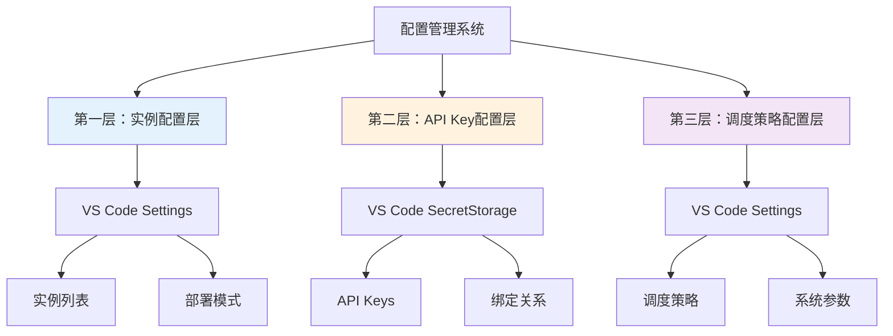

# 配置管理设计文档

## 概述

本文档详细描述了API Key Aggregator项目的分层配置管理系统设计，包括Serverless实例配置、API Key绑定机制以及向后兼容性保证措施。

## 分层配置管理系统

### 设计原则
1. **分层隔离**：不同类型的配置分层管理，避免相互影响
2. **安全优先**：敏感信息使用安全存储，配置信息使用标准存储
3. **向后兼容**：新配置不影响现有功能，支持渐进式升级
4. **用户友好**：提供简单直观的配置界面和合理的默认值

### 三层配置架构



## 第一层：实例配置层

### 存储位置
**VS Code Workspace Settings** (`settings.json`)

### 配置结构
```json
{
  "geminiAggregator.serverlessInstances": [
    {
      "id": "deno-us-east-1",
      "name": "US East (Virginia)",
      "url": "https://gemini-proxy-us-east.deno.dev",
      "region": "us-east-1",
      "maxKeys": 5,
      "priority": 1,
      "enabled": true,
      "timeout": 30000,
      "retryAttempts": 3,
      "healthCheckPath": "/health",
      "tags": ["production", "primary"],
      "createdAt": "2024-01-01T00:00:00Z",
      "updatedAt": "2024-01-01T00:00:00Z"
    }
  ]
}
```

### 数据模型定义
```typescript
interface ServerlessInstance {
  // 基础信息
  id: string                    // 实例唯一标识符
  name: string                  // 用户友好的显示名称
  url: string                   // 实例端点URL
  
  // 可选配置
  region?: string               // 部署区域标识
  maxKeys?: number              // 最大API Key数量限制
  priority?: number             // 实例优先级 (1-10)
  enabled?: boolean             // 是否启用此实例
  
  // 网络配置
  timeout?: number              // 请求超时时间(ms)
  retryAttempts?: number        // 重试次数
  healthCheckPath?: string      // 健康检查路径
  
  // 元数据
  tags?: string[]               // 实例标签
  createdAt?: string            // 创建时间
  updatedAt?: string            // 更新时间
  
  // 运行时状态 (不持久化)
  status?: 'active' | 'inactive' | 'error' | 'maintenance'
  lastHealthCheck?: number      // 最后健康检查时间
  responseTime?: number         // 平均响应时间
}
```

### 配置验证规则
```typescript
const instanceValidationRules = {
  id: {
    required: true,
    pattern: /^[a-zA-Z0-9-_]+$/,
    maxLength: 50
  },
  name: {
    required: true,
    maxLength: 100
  },
  url: {
    required: true,
    pattern: /^https?:\/\/.+/,
    validation: 'url-reachable'
  },
  maxKeys: {
    type: 'number',
    min: 1,
    max: 20,
    default: 5
  },
  priority: {
    type: 'number', 
    min: 1,
    max: 10,
    default: 5
  }
};
```

## 第二层：API Key配置层

### 存储位置
**VS Code SecretStorage** (加密存储)

### 现有API Key存储 (保持不变)
```typescript
// 现有存储结构保持完全兼容
{
  "geminiApiKeysIds": ["key1", "key2", "key3"],
  "geminiApiKeyCounter": "4",
  "key1": "actual-api-key-value-1",
  "key2": "actual-api-key-value-2", 
  "key3": "actual-api-key-value-3"
}
```

### 新增绑定关系存储
```typescript
// 新增的绑定关系配置
{
  "geminiApiKeyBindings": {
    "key1": {
      "instanceId": "deno-us-east-1",
      "assignedAt": "2024-01-01T00:00:00Z",
      "status": "active",
      "lastUsed": "2024-01-01T12:00:00Z"
    },
    "key2": {
      "instanceId": "deno-eu-west-1", 
      "assignedAt": "2024-01-01T00:00:00Z",
      "status": "active",
      "lastUsed": "2024-01-01T11:30:00Z"
    },
    "key3": {
      "instanceId": "local",  // 特殊值表示本地处理
      "assignedAt": "2024-01-01T00:00:00Z",
      "status": "active",
      "lastUsed": "2024-01-01T11:45:00Z"
    }
  }
}
```

### 绑定关系数据模型
```typescript
interface ApiKeyBinding {
  instanceId: string           // 绑定的实例ID，"local"表示本地处理
  assignedAt: string          // 绑定时间
  status: 'active' | 'inactive' | 'migrating'
  lastUsed?: string           // 最后使用时间
  usageCount?: number         // 使用次数统计
  notes?: string              // 备注信息
}

interface ApiKeyBindings {
  [keyId: string]: ApiKeyBinding
}
```

### API Key管理增强
```typescript
class EnhancedApiKeyManager extends ApiKeyManager {
  // 现有方法保持不变
  loadKeys(apiKeys: string[]): void
  getAvailableKey(): ApiKey | null
  markAsCoolingDown(key: string, durationMs: number): void
  
  // 新增绑定管理方法
  async bindKeyToInstance(keyId: string, instanceId: string): Promise<void>
  async unbindKey(keyId: string): Promise<void>
  async getKeyBinding(keyId: string): Promise<ApiKeyBinding | null>
  async getKeysForInstance(instanceId: string): Promise<string[]>
  async migrateKeyToInstance(keyId: string, newInstanceId: string): Promise<void>
}
```

## 第三层：调度策略配置层

### 存储位置
**VS Code Workspace Settings** (`settings.json`)

### 配置结构
```json
{
  "geminiAggregator.deployment": {
    "mode": "hybrid",
    "fallbackToLocal": true,
    "strategy": "round-robin"
  },
  "geminiAggregator.networking": {
    "timeout": 30000,
    "retryAttempts": 3,
    "retryDelay": 1000,
    "maxConcurrentRequests": 10
  },
  "geminiAggregator.monitoring": {
    "healthCheckInterval": 60000,
    "performanceTracking": true,
    "logLevel": "info",
    "enableMetrics": false
  }
}
```

### 配置数据模型
```typescript
interface DeploymentConfig {
  mode: 'local' | 'serverless' | 'hybrid'
  fallbackToLocal: boolean
  strategy: 'round-robin' | 'random' | 'priority-based'
}

interface NetworkingConfig {
  timeout: number              // 请求超时时间(ms)
  retryAttempts: number        // 重试次数
  retryDelay: number           // 重试延迟(ms)
  maxConcurrentRequests: number // 最大并发请求数
}

interface MonitoringConfig {
  healthCheckInterval: number   // 健康检查间隔(ms)
  performanceTracking: boolean  // 是否启用性能追踪
  logLevel: 'debug' | 'info' | 'warn' | 'error'
  enableMetrics: boolean       // 是否启用指标收集
}
```

## 配置管理器设计

### 统一配置管理器
```typescript
class ConfigurationManager {
  private context: vscode.ExtensionContext
  private instanceConfig: ServerlessInstance[]
  private deploymentConfig: DeploymentConfig
  private networkingConfig: NetworkingConfig
  private monitoringConfig: MonitoringConfig
  
  constructor(context: vscode.ExtensionContext) {
    this.context = context
    this.loadAllConfigurations()
  }
  
  // 实例配置管理
  async addInstance(instance: ServerlessInstance): Promise<void>
  async removeInstance(id: string): Promise<void>
  async updateInstance(id: string, updates: Partial<ServerlessInstance>): Promise<void>
  async getInstances(): Promise<ServerlessInstance[]>
  async getInstance(id: string): Promise<ServerlessInstance | null>
  
  // API Key绑定管理
  async bindKeyToInstance(keyId: string, instanceId: string): Promise<void>
  async getKeyBindings(): Promise<ApiKeyBindings>
  async updateKeyBinding(keyId: string, binding: ApiKeyBinding): Promise<void>
  
  // 配置更新和通知
  async updateDeploymentConfig(config: Partial<DeploymentConfig>): Promise<void>
  async updateNetworkingConfig(config: Partial<NetworkingConfig>): Promise<void>
  async updateMonitoringConfig(config: Partial<MonitoringConfig>): Promise<void>
  
  // 配置验证
  validateInstanceConfig(instance: ServerlessInstance): ValidationResult
  validateDeploymentConfig(config: DeploymentConfig): ValidationResult
  
  // 配置导入导出 (后续版本)
  async exportConfiguration(): Promise<string>
  async importConfiguration(configJson: string): Promise<void>
}
```

### 配置变更监听
```typescript
class ConfigurationWatcher {
  private listeners: Map<string, Function[]> = new Map()
  
  // 监听配置变更
  onInstanceConfigChanged(callback: (instances: ServerlessInstance[]) => void): void
  onDeploymentConfigChanged(callback: (config: DeploymentConfig) => void): void
  onKeyBindingChanged(callback: (bindings: ApiKeyBindings) => void): void
  
  // 触发配置变更事件
  private notifyInstanceConfigChanged(instances: ServerlessInstance[]): void
  private notifyDeploymentConfigChanged(config: DeploymentConfig): void
  private notifyKeyBindingChanged(bindings: ApiKeyBindings): void
}
```

## 向后兼容性保证

### 兼容性策略

#### 1. 配置隔离
- **新配置独立**：所有新配置使用独立的命名空间
- **现有配置不变**：现有API Key管理配置完全保持不变
- **默认行为保持**：未配置Serverless时，系统行为与原来完全一致

#### 2. 渐进式启用
```typescript
// 默认配置确保向后兼容
const defaultConfig: DeploymentConfig = {
  mode: 'local',              // 默认使用本地模式
  fallbackToLocal: true,      // 始终允许回退到本地
  strategy: 'round-robin'     // 使用现有的轮询策略
}
```

#### 3. 数据迁移策略
```typescript
class ConfigurationMigrator {
  // 检查是否需要迁移
  async needsMigration(): Promise<boolean>
  
  // 执行配置迁移
  async migrateConfiguration(): Promise<void>
  
  // 回滚迁移
  async rollbackMigration(): Promise<void>
  
  // 验证迁移结果
  async validateMigration(): Promise<boolean>
}
```

### 兼容性测试
```typescript
describe('Backward Compatibility Tests', () => {
  test('should work with existing API key configuration', async () => {
    // 测试现有API Key配置继续工作
  })
  
  test('should default to local mode for new installations', async () => {
    // 测试新安装默认使用本地模式
  })
  
  test('should not affect existing users without serverless config', async () => {
    // 测试未配置Serverless的用户不受影响
  })
})
```

## 配置界面设计

### 命令面板集成
```typescript
// 实例管理命令
const commands = [
  'geminiAggregator.addServerlessInstance',
  'geminiAggregator.editServerlessInstance', 
  'geminiAggregator.removeServerlessInstance',
  'geminiAggregator.testServerlessInstance',
  'geminiAggregator.setDeploymentMode',
  'geminiAggregator.bindApiKeyToInstance',
  'geminiAggregator.viewConfiguration'
]
```

### 配置向导
```typescript
class ConfigurationWizard {
  // 首次配置向导
  async runFirstTimeSetup(): Promise<void>
  
  // 添加实例向导
  async runAddInstanceWizard(): Promise<ServerlessInstance | null>
  
  // 绑定API Key向导
  async runBindKeyWizard(): Promise<void>
  
  // 配置验证向导
  async runConfigurationValidation(): Promise<ValidationResult>
}
```

## 错误处理和验证

### 配置验证
```typescript
interface ValidationResult {
  isValid: boolean
  errors: ValidationError[]
  warnings: ValidationWarning[]
}

interface ValidationError {
  field: string
  message: string
  code: string
}

class ConfigurationValidator {
  validateInstance(instance: ServerlessInstance): ValidationResult
  validateBinding(binding: ApiKeyBinding): ValidationResult
  validateDeploymentConfig(config: DeploymentConfig): ValidationResult
  
  // 网络连通性验证
  async validateInstanceConnectivity(instance: ServerlessInstance): Promise<boolean>
  
  // 配置一致性验证
  validateConfigurationConsistency(): ValidationResult
}
```

### 错误恢复机制
```typescript
class ConfigurationRecovery {
  // 备份当前配置
  async backupConfiguration(): Promise<string>
  
  // 恢复配置
  async restoreConfiguration(backup: string): Promise<void>
  
  // 重置为默认配置
  async resetToDefaults(): Promise<void>
  
  // 修复损坏的配置
  async repairConfiguration(): Promise<void>
}
```

## 安全考虑

### 敏感信息保护
1. **API Key安全**：继续使用VS Code SecretStorage加密存储
2. **URL验证**：验证Serverless实例URL的安全性
3. **访问控制**：确保只有授权用户可以修改配置
4. **审计日志**：记录配置变更操作

### 配置加密
```typescript
class SecureConfigurationManager {
  // 加密敏感配置
  async encryptSensitiveConfig(config: any): Promise<string>
  
  // 解密敏感配置
  async decryptSensitiveConfig(encrypted: string): Promise<any>
  
  // 验证配置完整性
  async verifyConfigurationIntegrity(): Promise<boolean>
}
```

## 性能优化

### 配置缓存
```typescript
class ConfigurationCache {
  private cache: Map<string, any> = new Map()
  private ttl: Map<string, number> = new Map()
  
  // 缓存配置
  set(key: string, value: any, ttlMs: number = 300000): void
  
  // 获取缓存
  get(key: string): any | null
  
  // 清理过期缓存
  cleanup(): void
}
```

### 配置懒加载
```typescript
class LazyConfigurationLoader {
  // 按需加载配置
  async loadConfigurationOnDemand(section: string): Promise<any>
  
  // 预加载关键配置
  async preloadCriticalConfiguration(): Promise<void>
}
```

---

*本文档将随着项目开发进展持续更新和完善*
