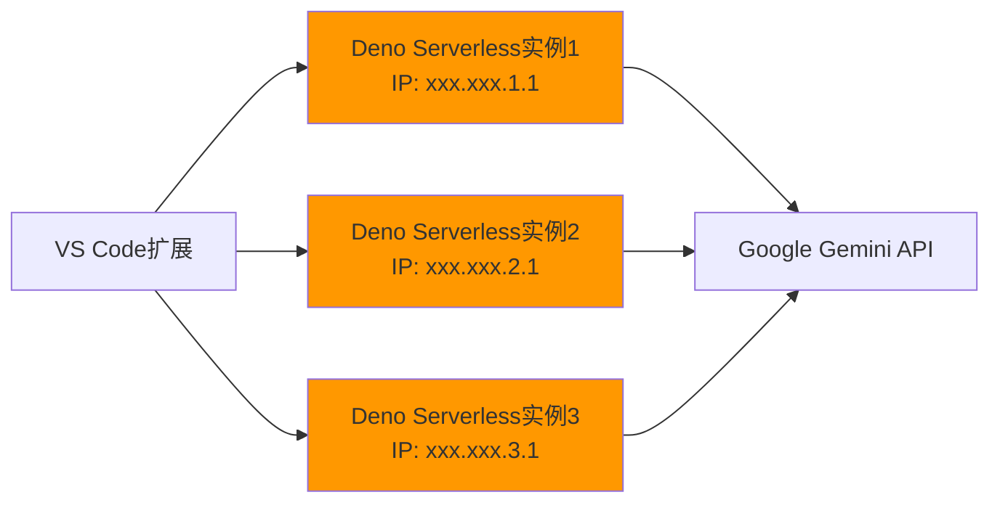

# Deno Serverless服务开发指南

## 概述

本文档详细描述了API Key Aggregator项目中Deno Serverless服务的开发需求、实现方案和部署策略。Deno Serverless服务作为分布式架构的核心组件，负责在不同IP地址上代理Google Gemini API请求。

## 核心功能和职责

### 🎯 主要职责
1. **API代理服务**：接收来自VS Code扩展的HTTP请求，转发到Google Gemini API
2. **流式响应处理**：支持Server-Sent Events (SSE)格式的流式响应转发
3. **健康检查**：提供健康状态监控端点，供VS Code扩展检查服务可用性
4. **错误处理**：统一处理API调用错误，包括rate limit、认证错误等
5. **CORS支持**：处理跨域请求，确保VS Code扩展能正常访问

### 🏗️ 架构定位


## 项目结构设计

### 📁 目录结构
```
deno-gemini-proxy/
├── main.ts                 # 服务入口点
├── deno.json              # Deno配置文件
├── .env                   # 环境变量配置
├── handlers/              # 请求处理器
│   ├── gemini.ts         # Gemini API代理处理
│   └── health.ts         # 健康检查处理
├── utils/                 # 工具函数
│   ├── cors.ts           # CORS配置
│   ├── error.ts          # 错误处理
│   └── logger.ts         # 日志记录
├── types/                 # 类型定义
│   └── api.ts            # API类型定义
├── tests/                 # 测试文件
│   ├── integration.test.ts
│   └── unit.test.ts
└── scripts/               # 部署脚本
    ├── deploy.sh         # 单实例部署
    └── deploy-multi.sh   # 多实例部署
```

## 核心代码实现

### 1. 服务入口点 (`main.ts`)
```typescript
import { serve } from "https://deno.land/std@0.208.0/http/server.ts";
import { handleGeminiRequest } from "./handlers/gemini.ts";
import { handleHealthCheck } from "./handlers/health.ts";
import { corsHeaders, handleCorsPreflightRequest } from "./utils/cors.ts";
import { logger } from "./utils/logger.ts";
import { createErrorResponse } from "./utils/error.ts";

const PORT = parseInt(Deno.env.get("PORT") || "8000");

async function handler(req: Request): Promise<Response> {
  const url = new URL(req.url);
  const method = req.method;
  
  // 记录请求日志
  logger.info(`${method} ${url.pathname}`, {
    userAgent: req.headers.get("user-agent"),
    origin: req.headers.get("origin")
  });
  
  try {
    // 处理CORS预检请求
    if (method === "OPTIONS") {
      return handleCorsPreflightRequest(req);
    }
    
    // 健康检查端点
    if (url.pathname === "/health") {
      return await handleHealthCheck(req);
    }
    
    // Gemini API代理端点
    if (url.pathname.startsWith("/v1beta/models/")) {
      return await handleGeminiRequest(req);
    }
    
    // 404处理
    return createErrorResponse({
      code: "NOT_FOUND",
      message: "Endpoint not found",
      status: 404
    });
    
  } catch (error) {
    logger.error("Unhandled error in request handler", error);
    return createErrorResponse({
      code: "INTERNAL_ERROR",
      message: "Internal server error",
      status: 500,
      details: error.message
    });
  }
}

// 启动服务器
console.log(`🚀 Deno Gemini Proxy starting on port ${PORT}`);
await serve(handler, { 
  port: PORT,
  onListen: ({ port, hostname }) => {
    logger.info(`Server running on http://${hostname}:${port}`);
  }
});
```

### 2. Gemini API处理器 (`handlers/gemini.ts`)
```typescript
import { GoogleGenerativeAI } from "npm:@google/generative-ai@^0.1.3";
import { corsHeaders } from "../utils/cors.ts";
import { createErrorResponse, handleGoogleApiError } from "../utils/error.ts";
import { logger } from "../utils/logger.ts";
import type { GeminiRequest, GeminiResponse } from "../types/api.ts";

export async function handleGeminiRequest(req: Request): Promise<Response> {
  try {
    // 1. 解析请求路径
    const url = new URL(req.url);
    const pathMatch = url.pathname.match(/^\/v1beta\/models\/([^\/]+)\/(.+)$/);
    
    if (!pathMatch) {
      return createErrorResponse({
        code: "INVALID_PATH",
        message: "Invalid API path format",
        status: 400
      });
    }
    
    const [, modelId, method] = pathMatch;
    
    // 2. 验证HTTP方法
    if (req.method !== "POST") {
      return createErrorResponse({
        code: "METHOD_NOT_ALLOWED",
        message: "Only POST method is allowed",
        status: 405
      });
    }
    
    // 3. 获取API Key
    const apiKey = req.headers.get("X-goog-api-key") || 
                   req.headers.get("authorization")?.replace("Bearer ", "");
    
    if (!apiKey) {
      return createErrorResponse({
        code: "MISSING_API_KEY",
        message: "API key is required",
        status: 401
      });
    }
    
    // 4. 解析请求体
    let requestBody: GeminiRequest;
    try {
      requestBody = await req.json();
    } catch (error) {
      return createErrorResponse({
        code: "INVALID_JSON",
        message: "Invalid JSON in request body",
        status: 400,
        details: error.message
      });
    }
    
    // 5. 验证请求体大小
    const contentLength = req.headers.get("content-length");
    const maxSize = parseInt(Deno.env.get("MAX_REQUEST_SIZE") || "8388608"); // 8MB
    if (contentLength && parseInt(contentLength) > maxSize) {
      return createErrorResponse({
        code: "REQUEST_TOO_LARGE",
        message: "Request body too large",
        status: 413
      });
    }
    
    // 6. 初始化Google AI客户端
    const genAI = new GoogleGenerativeAI(apiKey);
    const model = genAI.getGenerativeModel({ model: modelId });
    
    // 7. 记录请求信息
    logger.info(`Processing ${method} request for model ${modelId}`, {
      apiKeyPrefix: apiKey.substring(0, 8) + "...",
      contentLength: contentLength
    });
    
    // 8. 根据方法类型处理请求
    switch (method) {
      case "generateContent":
        return await handleNonStreamingRequest(model, requestBody, apiKey);
      case "streamGenerateContent":
        return await handleStreamingRequest(model, requestBody, apiKey);
      default:
        return createErrorResponse({
          code: "UNSUPPORTED_METHOD",
          message: `Unsupported method: ${method}`,
          status: 400
        });
    }
    
  } catch (error) {
    logger.error("Error in handleGeminiRequest", error);
    
    // 处理Google API特定错误
    if (error.status) {
      const apiError = handleGoogleApiError(error);
      return createErrorResponse(apiError);
    }
    
    return createErrorResponse({
      code: "INTERNAL_ERROR",
      message: "Internal server error",
      status: 500,
      details: error.message
    });
  }
}

// 处理非流式请求
async function handleNonStreamingRequest(
  model: any, 
  requestBody: GeminiRequest,
  apiKey: string
): Promise<Response> {
  const startTime = performance.now();
  
  try {
    const result = await model.generateContent(requestBody);
    const response = result.response;
    
    const duration = performance.now() - startTime;
    logger.info(`Non-streaming request completed`, {
      duration: `${duration.toFixed(2)}ms`,
      apiKeyPrefix: apiKey.substring(0, 8) + "..."
    });
    
    return new Response(
      JSON.stringify(response),
      {
        status: 200,
        headers: {
          "Content-Type": "application/json",
          "X-Response-Time": `${duration.toFixed(2)}ms`,
          ...corsHeaders
        }
      }
    );
    
  } catch (error) {
    const duration = performance.now() - startTime;
    logger.error(`Non-streaming request failed after ${duration.toFixed(2)}ms`, error);
    throw error;
  }
}

// 处理流式请求
async function handleStreamingRequest(
  model: any, 
  requestBody: GeminiRequest,
  apiKey: string
): Promise<Response> {
  const startTime = performance.now();
  
  try {
    const result = await model.generateContentStream(requestBody);
    
    logger.info(`Starting streaming request`, {
      apiKeyPrefix: apiKey.substring(0, 8) + "..."
    });
    
    const stream = new ReadableStream({
      async start(controller) {
        try {
          let chunkCount = 0;
          
          for await (const chunk of result.stream) {
            chunkCount++;
            const data = `data: ${JSON.stringify(chunk)}\n\n`;
            controller.enqueue(new TextEncoder().encode(data));
          }
          
          const duration = performance.now() - startTime;
          logger.info(`Streaming request completed`, {
            duration: `${duration.toFixed(2)}ms`,
            chunkCount,
            apiKeyPrefix: apiKey.substring(0, 8) + "..."
          });
          
          controller.close();
          
        } catch (error) {
          logger.error("Error in streaming response", error);
          controller.error(error);
        }
      }
    });
    
    return new Response(stream, {
      status: 200,
      headers: {
        "Content-Type": "text/event-stream",
        "Cache-Control": "no-cache",
        "Connection": "keep-alive",
        "X-Accel-Buffering": "no", // 禁用Nginx缓冲
        ...corsHeaders
      }
    });
    
  } catch (error) {
    const duration = performance.now() - startTime;
    logger.error(`Streaming request failed after ${duration.toFixed(2)}ms`, error);
    throw error;
  }
}
```

### 3. 健康检查处理器 (`handlers/health.ts`)
```typescript
import { corsHeaders } from "../utils/cors.ts";
import { logger } from "../utils/logger.ts";

interface HealthStatus {
  status: "healthy" | "unhealthy";
  timestamp: string;
  version: string;
  region: string;
  uptime: number;
  memory: {
    used: number;
    total: number;
  };
  environment: {
    denoVersion: string;
    platform: string;
  };
}

export async function handleHealthCheck(req: Request): Promise<Response> {
  try {
    const memoryUsage = Deno.memoryUsage();
    
    const healthStatus: HealthStatus = {
      status: "healthy",
      timestamp: new Date().toISOString(),
      version: Deno.env.get("SERVICE_VERSION") || "1.0.0",
      region: Deno.env.get("DENO_REGION") || "unknown",
      uptime: performance.now(),
      memory: {
        used: memoryUsage.heapUsed,
        total: memoryUsage.heapTotal
      },
      environment: {
        denoVersion: Deno.version.deno,
        platform: Deno.build.os
      }
    };
    
    // 可选：执行更深入的健康检查
    const detailed = new URL(req.url).searchParams.get("detailed") === "true";
    if (detailed) {
      // 可以添加数据库连接检查、外部服务检查等
      await performDetailedHealthCheck(healthStatus);
    }
    
    logger.debug("Health check performed", { 
      status: healthStatus.status,
      memoryUsed: healthStatus.memory.used 
    });
    
    return new Response(
      JSON.stringify(healthStatus, null, 2),
      {
        status: 200,
        headers: {
          "Content-Type": "application/json",
          ...corsHeaders
        }
      }
    );
    
  } catch (error) {
    logger.error("Health check failed", error);
    
    const errorStatus: HealthStatus = {
      status: "unhealthy",
      timestamp: new Date().toISOString(),
      version: Deno.env.get("SERVICE_VERSION") || "1.0.0",
      region: Deno.env.get("DENO_REGION") || "unknown",
      uptime: performance.now(),
      memory: { used: 0, total: 0 },
      environment: {
        denoVersion: Deno.version.deno,
        platform: Deno.build.os
      }
    };
    
    return new Response(
      JSON.stringify(errorStatus, null, 2),
      {
        status: 503,
        headers: {
          "Content-Type": "application/json",
          ...corsHeaders
        }
      }
    );
  }
}

async function performDetailedHealthCheck(healthStatus: HealthStatus): Promise<void> {
  // 这里可以添加更详细的健康检查逻辑
  // 例如：检查Google API连通性、检查内存使用率等
  
  const memoryUsagePercent = (healthStatus.memory.used / healthStatus.memory.total) * 100;
  
  if (memoryUsagePercent > 90) {
    logger.warn("High memory usage detected", { 
      usagePercent: memoryUsagePercent.toFixed(2) 
    });
  }
  
  // 可以根据检查结果修改healthStatus.status
}

## 工具函数实现

### 4. CORS配置 (`utils/cors.ts`)
```typescript
export const corsHeaders = {
  "Access-Control-Allow-Origin": "*",
  "Access-Control-Allow-Methods": "GET, POST, OPTIONS",
  "Access-Control-Allow-Headers": "Content-Type, Authorization, X-goog-api-key, x-request-id",
  "Access-Control-Max-Age": "86400", // 24小时
  "Access-Control-Expose-Headers": "x-response-time, x-request-id"
};

export function handleCorsPreflightRequest(req: Request): Response {
  const origin = req.headers.get("origin");
  const requestedMethod = req.headers.get("access-control-request-method");
  const requestedHeaders = req.headers.get("access-control-request-headers");

  // 可以根据需要添加更严格的CORS策略
  const allowedOrigins = Deno.env.get("ALLOWED_ORIGINS")?.split(",") || ["*"];

  let responseHeaders = { ...corsHeaders };

  if (origin && allowedOrigins.includes("*") || allowedOrigins.includes(origin)) {
    responseHeaders["Access-Control-Allow-Origin"] = origin;
  }

  return new Response(null, {
    status: 200,
    headers: responseHeaders
  });
}

export function addCorsHeaders(response: Response): Response {
  const headers = new Headers(response.headers);

  Object.entries(corsHeaders).forEach(([key, value]) => {
    headers.set(key, value);
  });

  return new Response(response.body, {
    status: response.status,
    statusText: response.statusText,
    headers
  });
}
```

### 5. 错误处理 (`utils/error.ts`)
```typescript
export interface ApiError {
  code: string;
  message: string;
  status: number;
  details?: any;
  timestamp?: string;
  requestId?: string;
}

export function createErrorResponse(error: ApiError): Response {
  const errorResponse = {
    error: {
      code: error.code,
      message: error.message,
      timestamp: error.timestamp || new Date().toISOString(),
      requestId: error.requestId || crypto.randomUUID(),
      ...(error.details && { details: error.details })
    }
  };

  return new Response(
    JSON.stringify(errorResponse, null, 2),
    {
      status: error.status,
      headers: {
        "Content-Type": "application/json",
        "X-Request-ID": errorResponse.error.requestId,
        ...corsHeaders
      }
    }
  );
}

export function handleGoogleApiError(error: any): ApiError {
  const requestId = crypto.randomUUID();

  // 处理Google API特定错误
  if (error.status === 429 || error.message?.includes("429")) {
    return {
      code: "RATE_LIMIT_EXCEEDED",
      message: "API rate limit exceeded. Please try again later.",
      status: 429,
      details: {
        retryAfter: "60s",
        originalError: error.message
      },
      requestId
    };
  }

  if (error.status === 401 || error.status === 403) {
    return {
      code: "AUTHENTICATION_ERROR",
      message: "Invalid or expired API key",
      status: 401,
      details: {
        originalError: error.message
      },
      requestId
    };
  }

  if (error.status === 400) {
    return {
      code: "BAD_REQUEST",
      message: "Invalid request parameters",
      status: 400,
      details: {
        originalError: error.message
      },
      requestId
    };
  }

  if (error.status >= 500) {
    return {
      code: "UPSTREAM_ERROR",
      message: "Google API service error",
      status: 502,
      details: {
        originalError: error.message,
        upstreamStatus: error.status
      },
      requestId
    };
  }

  // 默认错误处理
  return {
    code: "UNKNOWN_ERROR",
    message: "An unexpected error occurred",
    status: 500,
    details: {
      originalError: error.message
    },
    requestId
  };
}

export class TimeoutError extends Error {
  constructor(message: string, public timeoutMs: number) {
    super(message);
    this.name = "TimeoutError";
  }
}

export function withTimeout<T>(
  promise: Promise<T>,
  timeoutMs: number
): Promise<T> {
  return Promise.race([
    promise,
    new Promise<never>((_, reject) => {
      setTimeout(() => {
        reject(new TimeoutError(`Operation timed out after ${timeoutMs}ms`, timeoutMs));
      }, timeoutMs);
    })
  ]);
}
```

### 6. 日志记录 (`utils/logger.ts`)
```typescript
export enum LogLevel {
  DEBUG = 0,
  INFO = 1,
  WARN = 2,
  ERROR = 3
}

interface LogEntry {
  level: string;
  message: string;
  timestamp: string;
  data?: any;
  requestId?: string;
}

class Logger {
  private logLevel: LogLevel;

  constructor() {
    const envLogLevel = Deno.env.get("LOG_LEVEL")?.toUpperCase() || "INFO";
    this.logLevel = LogLevel[envLogLevel as keyof typeof LogLevel] ?? LogLevel.INFO;
  }

  private log(level: LogLevel, levelName: string, message: string, data?: any): void {
    if (level < this.logLevel) {
      return;
    }

    const logEntry: LogEntry = {
      level: levelName,
      message,
      timestamp: new Date().toISOString(),
      ...(data && { data })
    };

    const logString = JSON.stringify(logEntry);

    if (level >= LogLevel.ERROR) {
      console.error(logString);
    } else if (level >= LogLevel.WARN) {
      console.warn(logString);
    } else {
      console.log(logString);
    }
  }

  debug(message: string, data?: any): void {
    this.log(LogLevel.DEBUG, "DEBUG", message, data);
  }

  info(message: string, data?: any): void {
    this.log(LogLevel.INFO, "INFO", message, data);
  }

  warn(message: string, data?: any): void {
    this.log(LogLevel.WARN, "WARN", message, data);
  }

  error(message: string, error?: any): void {
    const errorData = error instanceof Error ? {
      name: error.name,
      message: error.message,
      stack: error.stack
    } : error;

    this.log(LogLevel.ERROR, "ERROR", message, errorData);
  }
}

export const logger = new Logger();

## 类型定义

### 7. API类型定义 (`types/api.ts`)
```typescript
// Google Gemini API请求类型
export interface GeminiRequest {
  contents: Content[];
  generationConfig?: GenerationConfig;
  safetySettings?: SafetySetting[];
  tools?: Tool[];
}

export interface Content {
  parts: Part[];
  role?: string;
}

export interface Part {
  text?: string;
  inlineData?: InlineData;
  functionCall?: FunctionCall;
  functionResponse?: FunctionResponse;
}

export interface InlineData {
  mimeType: string;
  data: string;
}

export interface GenerationConfig {
  temperature?: number;
  topP?: number;
  topK?: number;
  candidateCount?: number;
  maxOutputTokens?: number;
  stopSequences?: string[];
}

export interface SafetySetting {
  category: string;
  threshold: string;
}

export interface Tool {
  functionDeclarations: FunctionDeclaration[];
}

export interface FunctionDeclaration {
  name: string;
  description: string;
  parameters: any;
}

export interface FunctionCall {
  name: string;
  args: any;
}

export interface FunctionResponse {
  name: string;
  response: any;
}

// Google Gemini API响应类型
export interface GeminiResponse {
  candidates: Candidate[];
  promptFeedback?: PromptFeedback;
}

export interface Candidate {
  content: Content;
  finishReason?: string;
  index: number;
  safetyRatings?: SafetyRating[];
}

export interface PromptFeedback {
  safetyRatings: SafetyRating[];
  blockReason?: string;
}

export interface SafetyRating {
  category: string;
  probability: string;
}

// 服务内部类型
export interface ServiceConfig {
  port: number;
  logLevel: string;
  maxRequestSize: number;
  requestTimeout: number;
  allowedOrigins: string[];
}

export interface RequestMetrics {
  requestId: string;
  method: string;
  path: string;
  startTime: number;
  endTime?: number;
  duration?: number;
  statusCode?: number;
  apiKeyPrefix?: string;
  error?: string;
}
```

## 配置文件

### 8. Deno配置 (`deno.json`)
```json
{
  "tasks": {
    "start": "deno run --allow-net --allow-env main.ts",
    "dev": "deno run --allow-net --allow-env --watch main.ts",
    "test": "deno test --allow-net --allow-env tests/",
    "test:watch": "deno test --allow-net --allow-env --watch tests/",
    "lint": "deno lint",
    "fmt": "deno fmt",
    "check": "deno check main.ts"
  },
  "imports": {
    "@google/generative-ai": "npm:@google/generative-ai@^0.1.3",
    "@std/http": "https://deno.land/std@0.208.0/http/mod.ts",
    "@std/assert": "https://deno.land/std@0.208.0/assert/mod.ts"
  },
  "compilerOptions": {
    "allowJs": true,
    "lib": ["deno.window"],
    "strict": true
  },
  "fmt": {
    "files": {
      "include": ["src/", "tests/"],
      "exclude": ["node_modules/"]
    },
    "options": {
      "useTabs": false,
      "lineWidth": 100,
      "indentWidth": 2,
      "semiColons": true,
      "singleQuote": false,
      "proseWrap": "preserve"
    }
  },
  "lint": {
    "files": {
      "include": ["src/", "tests/"],
      "exclude": ["node_modules/"]
    },
    "rules": {
      "tags": ["recommended"],
      "include": ["ban-untagged-todo"],
      "exclude": ["no-unused-vars"]
    }
  }
}
```

### 9. 环境变量配置 (`.env`)
```bash
# 服务配置
PORT=8000
SERVICE_VERSION=1.0.0
LOG_LEVEL=info

# 请求限制
MAX_REQUEST_SIZE=8388608  # 8MB
REQUEST_TIMEOUT=30000     # 30秒

# CORS配置
ALLOWED_ORIGINS=*

# Deno Deploy配置
DENO_REGION=us-east-1

# 监控配置
ENABLE_METRICS=false
HEALTH_CHECK_INTERVAL=30000

# 安全配置
RATE_LIMIT_ENABLED=false
RATE_LIMIT_REQUESTS_PER_MINUTE=100

## 测试实现

### 10. 集成测试 (`tests/integration.test.ts`)
```typescript
import { assertEquals, assertExists } from "@std/assert";

const BASE_URL = "http://localhost:8000";
const TEST_API_KEY = "test-api-key-for-integration-testing";

Deno.test("Health check endpoint", async () => {
  const response = await fetch(`${BASE_URL}/health`);

  assertEquals(response.status, 200);
  assertEquals(response.headers.get("content-type"), "application/json");

  const data = await response.json();
  assertEquals(data.status, "healthy");
  assertExists(data.timestamp);
  assertExists(data.version);
  assertExists(data.uptime);
});

Deno.test("Health check with detailed info", async () => {
  const response = await fetch(`${BASE_URL}/health?detailed=true`);

  assertEquals(response.status, 200);

  const data = await response.json();
  assertEquals(data.status, "healthy");
  assertExists(data.memory);
  assertExists(data.environment);
});

Deno.test("CORS preflight request", async () => {
  const response = await fetch(`${BASE_URL}/v1beta/models/gemini-pro/generateContent`, {
    method: "OPTIONS",
    headers: {
      "Origin": "http://localhost:3000",
      "Access-Control-Request-Method": "POST",
      "Access-Control-Request-Headers": "Content-Type, X-goog-api-key"
    }
  });

  assertEquals(response.status, 200);
  assertEquals(response.headers.get("access-control-allow-origin"), "*");
  assertEquals(response.headers.get("access-control-allow-methods"), "GET, POST, OPTIONS");
});

Deno.test("Missing API key error", async () => {
  const response = await fetch(`${BASE_URL}/v1beta/models/gemini-pro/generateContent`, {
    method: "POST",
    headers: {
      "Content-Type": "application/json"
    },
    body: JSON.stringify({
      contents: [{ parts: [{ text: "Hello" }] }]
    })
  });

  assertEquals(response.status, 401);

  const data = await response.json();
  assertEquals(data.error.code, "MISSING_API_KEY");
});

Deno.test("Invalid JSON request body", async () => {
  const response = await fetch(`${BASE_URL}/v1beta/models/gemini-pro/generateContent`, {
    method: "POST",
    headers: {
      "Content-Type": "application/json",
      "X-goog-api-key": TEST_API_KEY
    },
    body: "invalid json"
  });

  assertEquals(response.status, 400);

  const data = await response.json();
  assertEquals(data.error.code, "INVALID_JSON");
});

Deno.test("Invalid API path", async () => {
  const response = await fetch(`${BASE_URL}/invalid/path`, {
    method: "POST",
    headers: {
      "Content-Type": "application/json",
      "X-goog-api-key": TEST_API_KEY
    }
  });

  assertEquals(response.status, 404);

  const data = await response.json();
  assertEquals(data.error.code, "NOT_FOUND");
});

Deno.test("Unsupported HTTP method", async () => {
  const response = await fetch(`${BASE_URL}/v1beta/models/gemini-pro/generateContent`, {
    method: "GET",
    headers: {
      "X-goog-api-key": TEST_API_KEY
    }
  });

  assertEquals(response.status, 405);

  const data = await response.json();
  assertEquals(data.error.code, "METHOD_NOT_ALLOWED");
});
```

### 11. 单元测试 (`tests/unit.test.ts`)
```typescript
import { assertEquals, assertThrows } from "@std/assert";
import { handleGoogleApiError, TimeoutError, withTimeout } from "../utils/error.ts";

Deno.test("handleGoogleApiError - Rate limit error", () => {
  const error = { status: 429, message: "Rate limit exceeded" };
  const result = handleGoogleApiError(error);

  assertEquals(result.code, "RATE_LIMIT_EXCEEDED");
  assertEquals(result.status, 429);
  assertEquals(result.details.retryAfter, "60s");
});

Deno.test("handleGoogleApiError - Authentication error", () => {
  const error = { status: 401, message: "Invalid API key" };
  const result = handleGoogleApiError(error);

  assertEquals(result.code, "AUTHENTICATION_ERROR");
  assertEquals(result.status, 401);
});

Deno.test("handleGoogleApiError - Unknown error", () => {
  const error = { message: "Unknown error" };
  const result = handleGoogleApiError(error);

  assertEquals(result.code, "UNKNOWN_ERROR");
  assertEquals(result.status, 500);
});

Deno.test("withTimeout - Success within timeout", async () => {
  const promise = new Promise(resolve => setTimeout(() => resolve("success"), 100));
  const result = await withTimeout(promise, 200);

  assertEquals(result, "success");
});

Deno.test("withTimeout - Timeout exceeded", async () => {
  const promise = new Promise(resolve => setTimeout(() => resolve("success"), 200));

  await assertThrows(
    async () => await withTimeout(promise, 100),
    TimeoutError,
    "Operation timed out after 100ms"
  );
}

## 本地开发和测试指南

### 开发环境设置

#### 1. 安装Deno
```bash
# macOS/Linux
curl -fsSL https://deno.land/install.sh | sh

# Windows (PowerShell)
irm https://deno.land/install.ps1 | iex

# 验证安装
deno --version
```

#### 2. 项目初始化
```bash
# 创建项目目录
mkdir deno-gemini-proxy
cd deno-gemini-proxy

# 创建基础文件结构
mkdir -p handlers utils types tests scripts
touch main.ts deno.json .env

# 初始化git仓库
git init
echo "node_modules/" > .gitignore
echo ".env" >> .gitignore
```

#### 3. 本地运行
```bash
# 开发模式（自动重载）
deno task dev

# 生产模式
deno task start

# 指定端口运行
PORT=3000 deno task start
```

### 本地测试流程

#### 1. 启动服务
```bash
# 终端1：启动服务
deno task dev
```

#### 2. 健康检查测试
```bash
# 终端2：测试健康检查
curl http://localhost:8000/health

# 详细健康检查
curl "http://localhost:8000/health?detailed=true"
```

#### 3. API代理测试
```bash
# 测试非流式请求
curl -X POST http://localhost:8000/v1beta/models/gemini-pro/generateContent \
  -H "Content-Type: application/json" \
  -H "X-goog-api-key: YOUR_ACTUAL_API_KEY" \
  -d '{
    "contents": [
      {
        "parts": [
          {
            "text": "Hello, how are you?"
          }
        ]
      }
    ]
  }'

# 测试流式请求
curl -X POST http://localhost:8000/v1beta/models/gemini-pro/streamGenerateContent \
  -H "Content-Type: application/json" \
  -H "X-goog-api-key: YOUR_ACTUAL_API_KEY" \
  -d '{
    "contents": [
      {
        "parts": [
          {
            "text": "Write a short story about a robot."
          }
        ]
      }
    ]
  }'
```

#### 4. 错误场景测试
```bash
# 测试缺少API key
curl -X POST http://localhost:8000/v1beta/models/gemini-pro/generateContent \
  -H "Content-Type: application/json" \
  -d '{"contents":[{"parts":[{"text":"Hello"}]}]}'

# 测试无效JSON
curl -X POST http://localhost:8000/v1beta/models/gemini-pro/generateContent \
  -H "Content-Type: application/json" \
  -H "X-goog-api-key: test-key" \
  -d 'invalid json'

# 测试不支持的方法
curl -X GET http://localhost:8000/v1beta/models/gemini-pro/generateContent \
  -H "X-goog-api-key: test-key"
```

#### 5. 运行自动化测试
```bash
# 运行所有测试
deno task test

# 运行特定测试文件
deno test tests/integration.test.ts --allow-net --allow-env

# 监视模式运行测试
deno task test:watch
```

### 调试技巧

#### 1. 日志调试
```bash
# 设置详细日志级别
LOG_LEVEL=debug deno task dev

# 查看实时日志
tail -f logs/app.log  # 如果配置了文件日志
```

#### 2. 性能分析
```bash
# 启用性能追踪
deno run --allow-net --allow-env --inspect main.ts

# 使用Chrome DevTools连接到 chrome://inspect
```

#### 3. 内存监控
```typescript
// 在代码中添加内存监控
setInterval(() => {
  const memUsage = Deno.memoryUsage();
  console.log(`Memory: ${(memUsage.heapUsed / 1024 / 1024).toFixed(2)}MB`);
}, 10000);
```

## 部署到Deno Deploy

### 部署准备

#### 1. 账户设置
```bash
# 安装Deno Deploy CLI
deno install --allow-read --allow-write --allow-env --allow-net --allow-run -n deployctl https://deno.land/x/deploy/deployctl.ts

# 登录Deno Deploy
deployctl login
```

#### 2. 项目配置
创建部署配置文件 (`deploy.config.json`)：
```json
{
  "name": "gemini-proxy",
  "description": "Gemini API Proxy Service",
  "regions": ["us-east-1", "eu-west-1", "ap-southeast-1"],
  "env": {
    "LOG_LEVEL": "info",
    "MAX_REQUEST_SIZE": "8388608",
    "REQUEST_TIMEOUT": "30000"
  }
}
```

### 单实例部署

#### 部署脚本 (`scripts/deploy.sh`)
```bash
#!/bin/bash

# 部署配置
PROJECT_NAME="gemini-proxy"
REGION=${1:-"us-east-1"}
ENTRY_POINT="main.ts"

echo "🚀 Deploying $PROJECT_NAME to $REGION..."

# 检查文件
if [ ! -f "$ENTRY_POINT" ]; then
    echo "❌ Entry point file $ENTRY_POINT not found"
    exit 1
fi

# 执行部署
deployctl deploy \
    --project="$PROJECT_NAME-$REGION" \
    --description="Gemini API Proxy - $REGION" \
    --env-file=.env \
    "$ENTRY_POINT"

if [ $? -eq 0 ]; then
    echo "✅ Deployment successful!"
    echo "🌐 URL: https://$PROJECT_NAME-$REGION.deno.dev"
else
    echo "❌ Deployment failed"
    exit 1
fi
```

### 多区域实例部署

#### 多实例部署脚本 (`scripts/deploy-multi.sh`)
```bash
#!/bin/bash

# 配置多个部署区域
REGIONS=("us-east-1" "eu-west-1" "ap-southeast-1")
PROJECT_BASE="gemini-proxy"
ENTRY_POINT="main.ts"

echo "🌍 Starting multi-region deployment..."

# 部署结果跟踪
SUCCESSFUL_DEPLOYMENTS=()
FAILED_DEPLOYMENTS=()

for region in "${REGIONS[@]}"; do
    echo ""
    echo "📍 Deploying to $region..."

    # 设置区域特定的环境变量
    export DENO_REGION="$region"

    # 执行部署
    deployctl deploy \
        --project="$PROJECT_BASE-$region" \
        --description="Gemini API Proxy - $region" \
        --env="DENO_REGION=$region" \
        --env="LOG_LEVEL=info" \
        --env="MAX_REQUEST_SIZE=8388608" \
        "$ENTRY_POINT"

    if [ $? -eq 0 ]; then
        echo "✅ $region deployment successful"
        SUCCESSFUL_DEPLOYMENTS+=("$region")

        # 验证部署
        URL="https://$PROJECT_BASE-$region.deno.dev"
        echo "🔍 Verifying deployment at $URL..."

        # 等待服务启动
        sleep 5

        # 健康检查
        if curl -f -s "$URL/health" > /dev/null; then
            echo "✅ Health check passed for $region"
        else
            echo "⚠️  Health check failed for $region"
        fi
    else
        echo "❌ $region deployment failed"
        FAILED_DEPLOYMENTS+=("$region")
    fi
done

# 部署总结
echo ""
echo "📊 Deployment Summary:"
echo "✅ Successful: ${SUCCESSFUL_DEPLOYMENTS[*]}"
echo "❌ Failed: ${FAILED_DEPLOYMENTS[*]}"

# 生成实例列表配置
if [ ${#SUCCESSFUL_DEPLOYMENTS[@]} -gt 0 ]; then
    echo ""
    echo "📋 VS Code Extension Configuration:"
    echo "{"
    echo '  "geminiAggregator.serverlessInstances": ['

    for i in "${!SUCCESSFUL_DEPLOYMENTS[@]}"; do
        region="${SUCCESSFUL_DEPLOYMENTS[$i]}"
        url="https://$PROJECT_BASE-$region.deno.dev"

        echo "    {"
        echo "      \"id\": \"deno-$region\","
        echo "      \"name\": \"Deno Deploy - $region\","
        echo "      \"url\": \"$url\","
        echo "      \"region\": \"$region\""

        if [ $i -eq $((${#SUCCESSFUL_DEPLOYMENTS[@]} - 1)) ]; then
            echo "    }"
        else
            echo "    },"
        fi
    done

    echo "  ]"
    echo "}"
fi

# 退出状态
if [ ${#FAILED_DEPLOYMENTS[@]} -eq 0 ]; then
    echo ""
    echo "🎉 All deployments completed successfully!"
    exit 0
else
    echo ""
    echo "⚠️  Some deployments failed. Check the logs above."
    exit 1
fi
```

## 性能优化建议

### 1. 连接池优化
```typescript
// utils/connection-pool.ts
class ConnectionPool {
  private connections: Map<string, any> = new Map();
  private maxConnections = 10;

  async getConnection(url: string): Promise<any> {
    if (!this.connections.has(url)) {
      // 创建新连接
      const connection = await this.createConnection(url);
      this.connections.set(url, connection);
    }
    return this.connections.get(url);
  }

  private async createConnection(url: string): Promise<any> {
    // 实现连接创建逻辑
    return { url, created: Date.now() };
  }
}
```

### 2. 请求缓存机制
```typescript
// utils/cache.ts
interface CacheEntry {
  data: any;
  timestamp: number;
  ttl: number;
}

class RequestCache {
  private cache: Map<string, CacheEntry> = new Map();
  private defaultTTL = 300000; // 5分钟

  set(key: string, data: any, ttl?: number): void {
    this.cache.set(key, {
      data,
      timestamp: Date.now(),
      ttl: ttl || this.defaultTTL
    });
  }

  get(key: string): any | null {
    const entry = this.cache.get(key);
    if (!entry) return null;

    if (Date.now() - entry.timestamp > entry.ttl) {
      this.cache.delete(key);
      return null;
    }

    return entry.data;
  }

  generateKey(request: any): string {
    // 生成请求的缓存键
    return crypto.createHash('sha256')
      .update(JSON.stringify(request))
      .digest('hex');
  }
}
```

### 3. 响应压缩
```typescript
// utils/compression.ts
export function compressResponse(response: string): Uint8Array {
  // 使用gzip压缩响应
  return new TextEncoder().encode(response);
}

export function shouldCompress(request: Request): boolean {
  const acceptEncoding = request.headers.get('accept-encoding') || '';
  return acceptEncoding.includes('gzip');
}
```

## 监控方案

### 1. 性能指标收集
```typescript
// utils/metrics.ts
interface Metrics {
  requestCount: number;
  errorCount: number;
  averageResponseTime: number;
  activeConnections: number;
}

class MetricsCollector {
  private metrics: Metrics = {
    requestCount: 0,
    errorCount: 0,
    averageResponseTime: 0,
    activeConnections: 0
  };

  private responseTimes: number[] = [];

  recordRequest(responseTime: number, isError: boolean = false): void {
    this.metrics.requestCount++;
    if (isError) this.metrics.errorCount++;

    this.responseTimes.push(responseTime);
    if (this.responseTimes.length > 100) {
      this.responseTimes.shift();
    }

    this.metrics.averageResponseTime =
      this.responseTimes.reduce((a, b) => a + b, 0) / this.responseTimes.length;
  }

  getMetrics(): Metrics {
    return { ...this.metrics };
  }

  reset(): void {
    this.metrics = {
      requestCount: 0,
      errorCount: 0,
      averageResponseTime: 0,
      activeConnections: 0
    };
    this.responseTimes = [];
  }
}

export const metricsCollector = new MetricsCollector();
```

### 2. 监控端点
```typescript
// handlers/metrics.ts
import { metricsCollector } from "../utils/metrics.ts";

export async function handleMetrics(req: Request): Promise<Response> {
  const metrics = metricsCollector.getMetrics();

  // Prometheus格式输出
  const prometheusMetrics = `
# HELP http_requests_total Total number of HTTP requests
# TYPE http_requests_total counter
http_requests_total ${metrics.requestCount}

# HELP http_errors_total Total number of HTTP errors
# TYPE http_errors_total counter
http_errors_total ${metrics.errorCount}

# HELP http_request_duration_ms Average HTTP request duration in milliseconds
# TYPE http_request_duration_ms gauge
http_request_duration_ms ${metrics.averageResponseTime}

# HELP http_active_connections Current number of active connections
# TYPE http_active_connections gauge
http_active_connections ${metrics.activeConnections}
  `.trim();

  return new Response(prometheusMetrics, {
    status: 200,
    headers: {
      "Content-Type": "text/plain; version=0.0.4"
    }
  });
}
```

## 开发清单和验证步骤

### 📋 开发清单

#### 基础功能
- [ ] 创建项目结构和配置文件
- [ ] 实现HTTP服务器入口点
- [ ] 实现Gemini API代理处理器
- [ ] 实现健康检查端点
- [ ] 配置CORS和安全策略
- [ ] 实现错误处理和日志记录
- [ ] 添加类型定义

#### 测试和质量
- [ ] 编写单元测试
- [ ] 编写集成测试
- [ ] 配置代码格式化和检查
- [ ] 性能测试和优化
- [ ] 安全审查

#### 部署和运维
- [ ] 本地开发环境测试
- [ ] 单实例部署脚本
- [ ] 多区域部署脚本
- [ ] CI/CD流水线配置
- [ ] 监控和日志配置

#### 集成和文档
- [ ] 与VS Code扩展集成测试
- [ ] API文档编写
- [ ] 部署指南编写
- [ ] 故障排除文档

### ✅ 验证步骤

#### 1. 本地验证
```bash
# 启动服务
deno task dev

# 健康检查
curl http://localhost:8000/health

# API功能测试
curl -X POST http://localhost:8000/v1beta/models/gemini-pro/generateContent \
  -H "Content-Type: application/json" \
  -H "X-goog-api-key: YOUR_API_KEY" \
  -d '{"contents":[{"parts":[{"text":"Hello"}]}]}'

# 运行测试套件
deno task test
```

#### 2. 部署验证
```bash
# 部署到Deno Deploy
./scripts/deploy.sh us-east-1

# 验证部署
curl https://gemini-proxy-us-east-1.deno.dev/health

# 多区域部署
./scripts/deploy-multi.sh
```

#### 3. 集成验证
```bash
# 配置VS Code扩展
# 测试请求转发
# 验证错误处理
# 检查性能指标
```

#### 4. 生产验证
```bash
# 负载测试
# 故障转移测试
# 监控告警测试
# 安全扫描
```

---

*本文档提供了Deno Serverless服务开发的完整指南，涵盖了从开发到部署的全流程。开发者可以按照本文档逐步实现和部署服务。*
